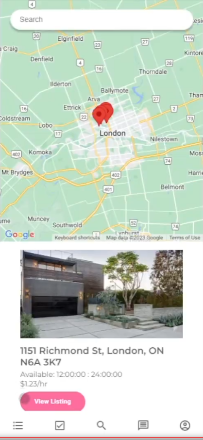
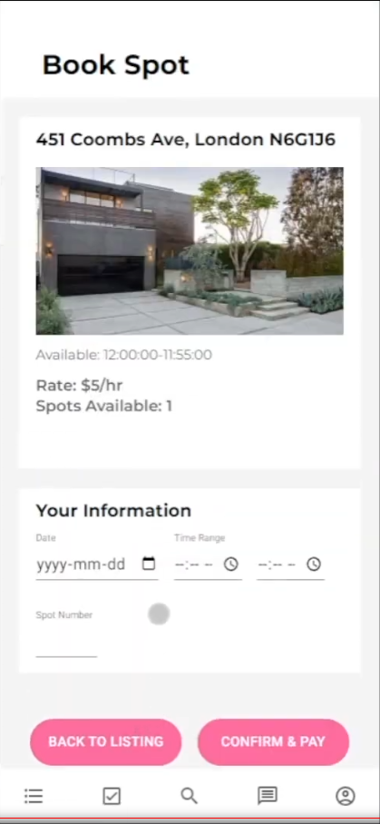
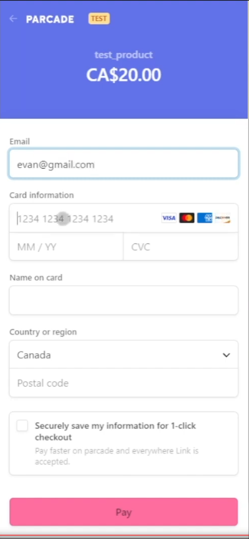

# Parcade - A Parking Services Application

"Your Key to Affordable Parking and Earning Cash!"

Parcade is the ultimate parking app that offers affordable and accessible parking options while helping homeowners monetize their extra parking spaces. Simply create an account, verify your identity using our one-shot learning facial recognition algorithm, and gain access to a map displaying vacant parking spots near your desired location. Rent a spot for the duration you need, securely complete transactions within the app using Stripe, and enjoy convenient parking!

## Screenshots

|  |  |
| --------------------------------- | ------------------------------------- |
|   |    |

## Demo

Coming Soon

## Authors

-   [@jacob](https://github.com/jmutton2)
-   [@sashintha](https://github.com/sashintha)
-   [@saumya](https://github.com/Saummmm)
-   [@karis](https://github.com/kliao25)
-   [@raj](https://github.com/rpate366)
